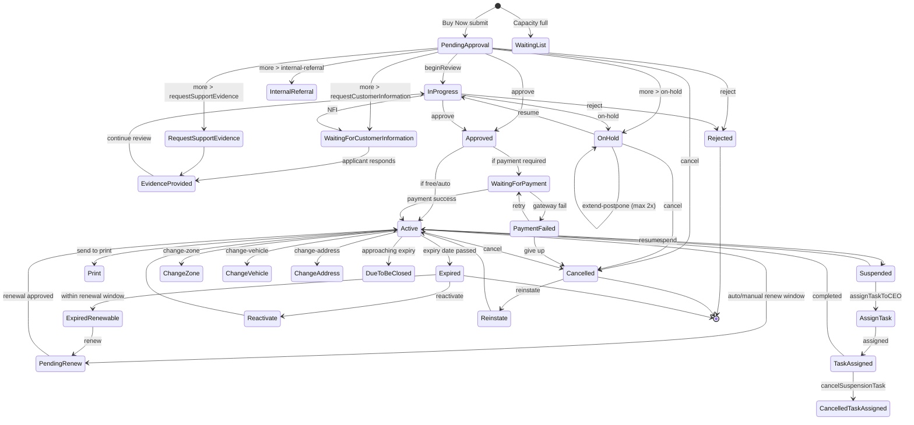

# Application / Permit Business Workflow — TRUTH

> Source of truth: `MNPS-Permission-RestAPI/Src/Infra/Common/CommonEnum.cs` lines 898-1004 (`TypeOfApplicationStatus`) + `MNPS-Permission-UI/src/app/(pages)/applications/page.tsx` lines 933-1026 (`handleStatusAction`).
> The previous 14-state diagram I gave was incomplete. Real system has **35 states**.

## All 35 Application Statuses (the State Machine)

| ID | Enum Name | Display Name (UI / DB) | Bucket |
|----|-----------|------------------------|--------|
| 1  | PendingApproval | Pending Approval | Pre-approval |
| 2  | WaitingList | Waiting List | Pre-approval |
| 3  | InProgress | In Progress | Under Review |
| 4  | WaitingForCustomerInformation | Waiting for Customer Information | NFI |
| 5  | RequestSupportEvidence | Request Support Evidence | NFI |
| 6  | EvidenceProvided | Evidence Provided | NFI |
| 7  | WaitingForPayment | Waiting for Payment | Payment |
| 8  | PaymentFailed | Payment Failed | Payment |
| 9  | Approved | Approved | Decision |
| 10 | InternalReferral | Internal Referral | Review |
| 11 | Rejected | Rejected | Decision (terminal) |
| 12 | OnHold | On-Hold | Hold |
| 13 | Active | Active | Live permit |
| 14 | Print | Print | Fulfilment |
| 15 | DueToBeClosed | Due to Be Closed | End-of-life |
| 16 | Cancelled | Cancelled | Terminal |
| 17 | Suspended | Suspended | Live (paused) |
| 18 | ChangeZone | Change Zone | Amendment |
| 19 | ChangeVehicle | Change Vehicle | Amendment |
| 20 | ChangeAddress | Change Address | Amendment |
| 21 | AddressChallengeApproved | Address Challenge Approved | Amendment |
| 22 | ChangeAddressChallenge | Change Address Challenge | Amendment |
| 23 | Reinstate | Reinstate | Recovery |
| 24 | Activate | Activate | Lifecycle action |
| 25 | Expired | Expired | Terminal |
| 26 | Reactivate | Reactivate | Recovery |
| 27 | PendingRenew | Pending Renew | Renewal |
| 28 | PendingPreApproval | Pending Pre-Approval | Pre-approval |
| 29 | ExpiredRenewable | Expired-Renewable | Renewal |
| 30 | AssignTask | Assign Task | Suspension (CEO) |
| 31 | TaskAssigned | Task Assigned | Suspension (CEO) |
| 32 | ExpiredAssignTask | Expired Assign Task | Suspension |
| 33 | ExpiredTaskAssigned | Expired Task Assigned | Suspension |
| 34 | CancelledAssignTask | Cancelled Assign Task | Suspension |
| 35 | CancelledTaskAssigned | Cancelled Task Assigned | Suspension |

## UI Action Buttons → Backend Calls

From `handleStatusAction(action)` switch in `applications/page.tsx`:

| Button action | Opens | Backend API |
|---------------|-------|-------------|
| `approve` | Action slider (approve) | `PUT api/Application/{id}/Contract/{c}/UpdateApplicationStatus` |
| `reject` | Action slider (reject, with reasons) | same `UpdateApplicationStatus` (RejectReasons feed dropdown) |
| `cancel` / `cancelApplication` | Action slider (cancel, with reasons) | `POST api/Application/{id}/Contract/{c}/CancelApplication` |
| `suspend` | Action slider (suspend, with reasons) | `UpdateApplicationStatus` |
| `resume` | Resume confirmation dialog | `PUT api/Application/{id}/Contract/{c}/Resume` |
| `renew` | Renewal slider | `PUT api/Application/{id}/Contract/{c}/Renew` + `UploadRenewalDetails` |
| `reinstate` | Action slider | `UpdateApplicationStatus` |
| `extend-postpone` | Extend duration slider (max 2 times, On-Hold only) | `PUT api/Application/{id}/Contract/{c}/ExtendHoldDuration` |
| `activate` / `reactivate` | Resume dialog | `UpdateApplicationStatus` |
| `beginReview` | Inline action | `PUT api/ApplicationReview/.../BeginReview` |
| `submit` / `submitToProcess` | Submit confirm dialog | `PUT api/Workflow/.../ProceedToSubmit` |
| `assignTaskToCEO` | Slider | Suspension task assign |
| `cancelTask` / `cancelSuspensionTask` | Dialog | `POST api/Suspension/.../CancelSuspensionTask` |
| `addAddressAssign` | Action slider | Address challenge / change flow |

## "More" Menu Sub-Actions
(lines 2163-2197) — these surface inside a kebab menu when room runs out on the toolbar:
- `requestSupportEvidence` (status 5)
- `internal-referral` (status 10)
- `on-hold` (status 12)
- `requestCustomerInformation` (status 4 — NFI)
- `change-zone` (status 18)
- `change-address` (status 20)
- `renew` (status 27 → 13)

## Reason Master Data (dropdowns)
Each "reason" action loads its own master list from API:
- `GET api/Application/Contract/{c}/CancelReasons`
- `GET api/Application/Contract/{c}/HoldReasons`
- `GET api/Application/Contract/{c}/RejectReasons`
- `GET api/Application/Contract/{c}/SuspendReasons`

These are configurable in **MNPS Contract Settings → Reject Reasons** etc.

## Workflow Diagram (high-level)



## Button Visibility Rule (CRITICAL for tests)
Buttons are NOT always visible. The list of buttons rendered depends on `workQueueStatus` of the loaded application. The configuration starts at `page.tsx` ~line 1236 (`<DPSButton ... onClick={() => handleStatusAction(btn.action)}>`) where `btn` comes from a status-keyed config array. When writing tests:

1. Load app in given status (use API or seed data)
2. Assert visible action buttons match the status
3. Click action → assert status flips → assert audit log entry

## What's NEW vs the doc/README.md I had

| Was missing | Now have |
|-------------|----------|
| Only 14 states listed | All 35 states with int IDs |
| Treated Suspended as simple | Real flow has 6 suspension sub-states (30-35) |
| No "Reinstate / Reactivate" actions | Both are first-class state transitions |
| "NFI" was vague | Actually 3 states: 4, 5, 6 |
| No amendment flow | ChangeZone/Vehicle/Address are real states (18-22) |
| No "Print" as state | Status 14 is a real workflow stop |
| No Address Challenge | States 21-22 cover this flow |

## How tests should use this
```csharp
public static class ApplicationStatus
{
    public const int PendingApproval = 1;
    public const int InProgress      = 3;
    public const int Approved        = 9;
    public const int Active          = 13;
    public const int OnHold          = 12;
    public const int Suspended       = 17;
    public const int Cancelled       = 16;
    public const int Expired         = 25;
    // ...etc
}
```
Use these IDs when querying API directly to seed test apps in a specific state.
